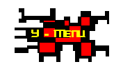



## How to make an individual Form \- ActiveX Control

### Description

This Code shows how to make an ActiveX-Control that gives a Form the shape of a bitmap or the shape of any text. Includes Demo Projects.

Very Cool Effect! Must see!
 
### More Info
 
Before you can start the Demo Projects you have to install the ActiveX Control.

             |
---                |---
**Submitted On**   |2000-07-06 21:37:36
**By**             |[Druid Developing](https://github.com/Planet-Source-Code/PSCIndex/blob/master/ByAuthor/druid-developing.md)
**Level**          |Advanced
**User Rating**    |4.8 (29 globes from 6 users)
**Compatibility**  |VB 3\.0, VB 4\.0 \(16\-bit\), VB 4\.0 \(32\-bit\), VB 5\.0, VB 6\.0, VB Script, ASP \(Active Server Pages\) 
**Category**       |[Custom Controls/ Forms/  Menus](https://github.com/Planet-Source-Code/PSCIndex/blob/master/ByCategory/custom-controls-forms-menus__1-4.md)
**World**          |[Visual Basic](https://github.com/Planet-Source-Code/PSCIndex/blob/master/ByWorld/visual-basic.md)
**Archive File**   |[CODE\_UPLOAD7489762000\.zip](https://github.com/Planet-Source-Code/druid-developing-how-to-make-an-individual-form-activex-control__1-9558/archive/master.zip)

